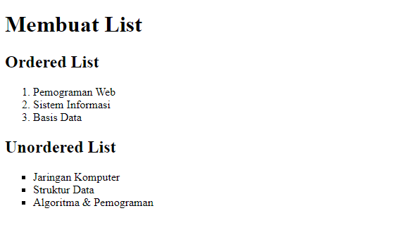
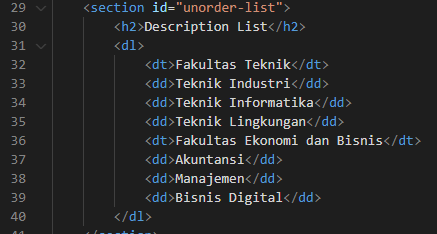
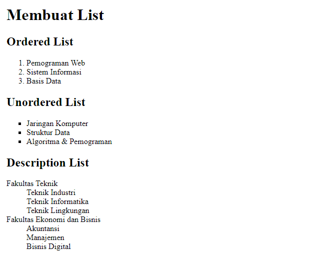
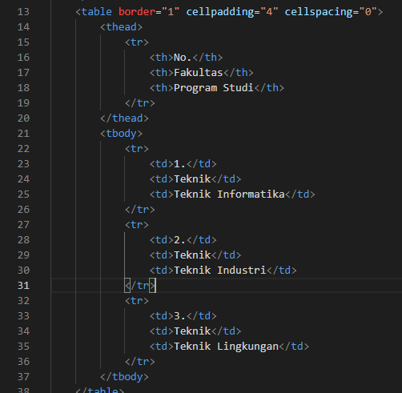
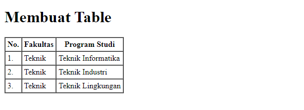

# LAB3WEB
#BELAJAR MEMBUAT LIST

#Ordered List

Langkah pertama membuat dokumen HTML, kemudian untuk kode tag yang digunakan untuk membuat Ordered List adalah <ol>
berikut contoh kodingan nya.  
  
  

Tampilan website nya seperti ini
  
  

  
  
#Unorderd List
Kemudian tambakan kode untuk membuat Unordered List dengan kode tag <ul>
setelah deklarasi ordered list pada Section unordered-list,seperti berikut.
  

 
  
Tampilan website nya seperti ini
  
   

#Description List
Kode tag yang digunakan untuk deskripsi list adalah <dl>, seperti berikut.

  
 
  
Tampilan website nya seperti ini
  
  
 
  

  
  
Belajar Membuat Tabel

  
Untuk mengatur margin dan padding pada cel data, tambahkan atribut cellpadding dan cellspacing pada tag table. Untuk contohnya sebagai berikut

    
  
  
Tampilan website nya seperti ini
  
  

